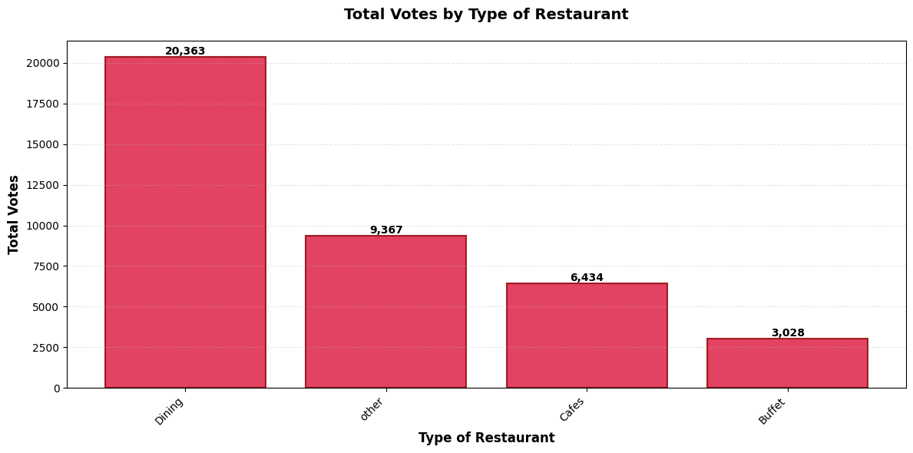
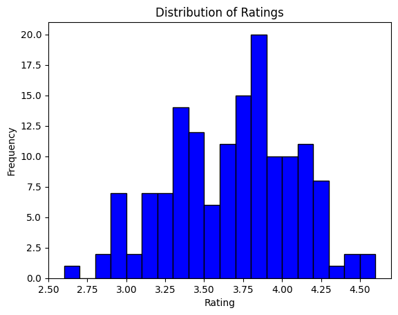
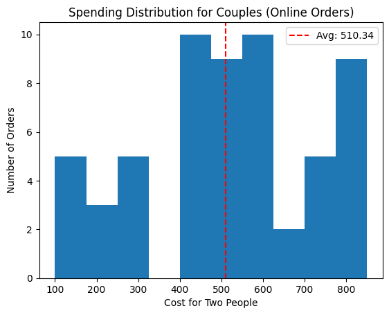
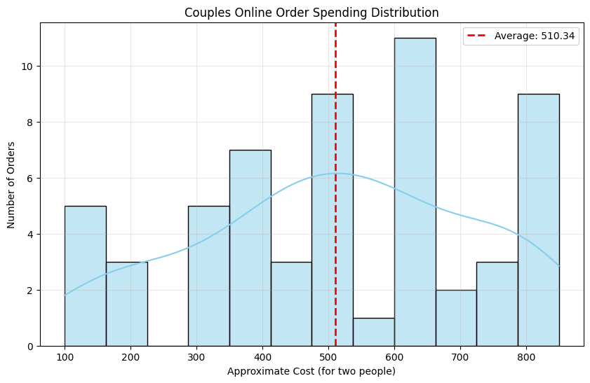
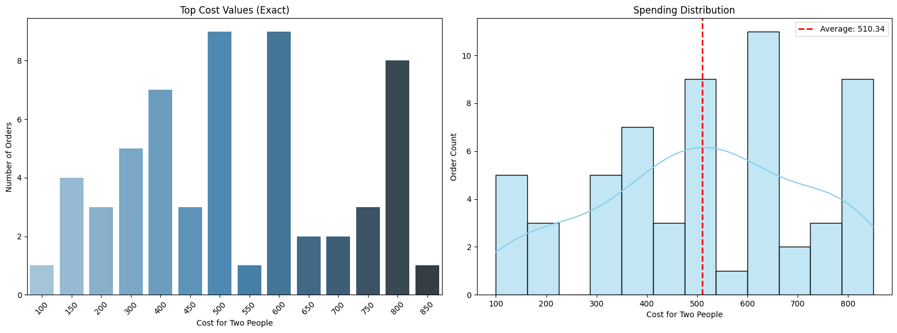
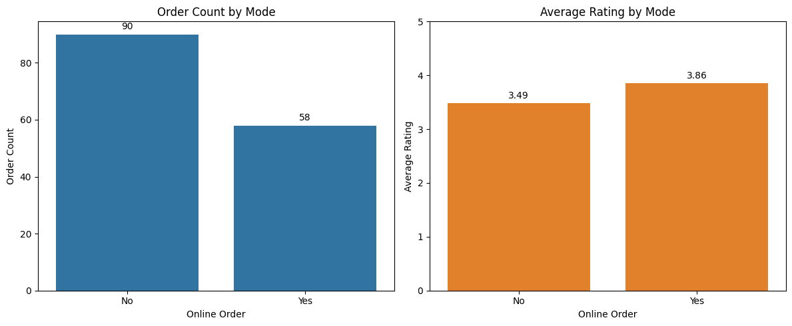
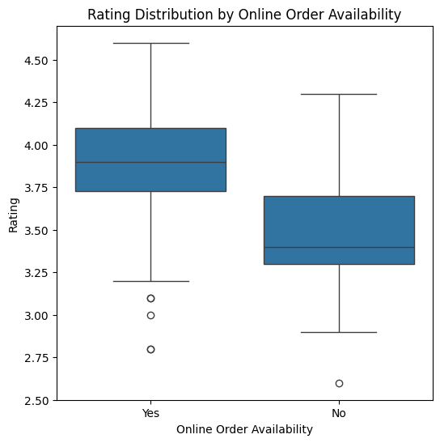
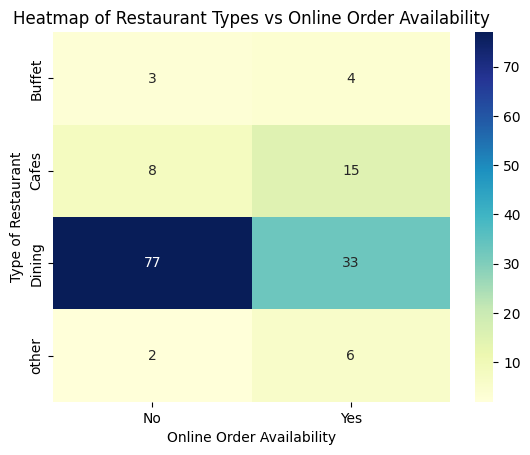

# Zomata Data Analysis

A complete exploratory data analysis project for Zomato restaurant dataset, built in Jupyter Notebook. This project analyzes restaurant types, customer ratings, voting patterns, and online vs offline ordering behavior to identify key business insights and marketing opportunities.

## Table of Contents

- [About](#about)
- [Project Goals](#project-goals)
- [Files](#files)
- [Data Analysis & Visualizations](#data-analysis--visualizations)
- [Key Insights](#key-insights)
- [How to Run](#how-to-run)
- [License](#license)

## About

This project is an **exploratory data analysis (EDA)** of the Zomato restaurant ecosystem, demonstrating proficiency in:

- **Data Wrangling**: Loading, cleaning, and transforming CSV data using pandas
- **Statistical Analysis**: Descriptive statistics, distributions, and group aggregations
- **Data Visualization**: Creating meaningful charts with matplotlib and seaborn
- **Business Intelligence**: Translating data into actionable recommendations
- **Documentation**: Professional project structure and stakeholder-ready insights

**Why this project?**
Zomato is a major food delivery and restaurant discovery platform. Understanding restaurant performance patterns, customer preferences, and ordering modes provides valuable insights for:
- Restaurant partners optimizing their online presence
- Marketing teams targeting high-potential segments
- Product teams improving platform features

**Skills Demonstrated:**
✅ Python (pandas, numpy, matplotlib, seaborn)  
✅ Jupyter Notebook for reproducible analysis  
✅ Data visualization best practices  
✅ Business insights & recommendations  
✅ Git version control & GitHub collaboration  
✅ Professional documentation & open-source readiness

## Project Goals

- Identify which restaurant types are most popular among customers
- Analyze total votes received by each restaurant type
- Understand rating distribution across the dataset
- Calculate average spending for couples ordering online
- Compare online vs offline customer satisfaction and order volume
- Determine which restaurant types benefit most from online ordering

## Files

- `Zomata Data Analysis.ipynb` - main Jupyter analysis notebook
- `Zomato data .csv` - dataset with 151 restaurant records
- `charts/` - folder containing all visualization outputs
- `.gitignore` - ignores notebook checkpoints and temporary files
- `LICENSE` - MIT license for open-source sharing
- `README.md` - this file

## Data Analysis & Visualizations

### 1. Restaurant Type Distribution


**Analysis:** 
- **Dining** dominates with 110 restaurants, representing 73% of the dataset
- **Cafes** account for 23 restaurants (15%)
- **Other** category: 10 restaurants (7%)
- **Buffet**: 8 restaurants (5%)

**Conclusion:** Dining is overwhelmingly the most common restaurant format on Zomato, suggesting it is the core business focus or that dining venues are more inclined to partner with the platform.

---

### 2. Total Votes by Restaurant Type



**Analysis:**
- **Dining** leads significantly with **20,363 total votes** (57% of all votes)
- **Other** type: 9,367 votes (26%)
- **Cafes**: 6,434 votes (18%)
- **Buffet**: 3,028 votes (9%)

**Conclusion:** Dining restaurants receive far more customer engagement, indicating higher customer traffic and interest. This validates that dining is Zomato's primary service category and should be the focus of promotional campaigns.

---

### 3. Rating Distribution



**Analysis:**
- Ratings are heavily concentrated between **3.0 and 4.5**
- Peak frequency occurs at **3.75–4.0 range** with ~20 restaurants
- Very few restaurants below 3.0 or above 4.5
- The distribution is left-skewed, with most restaurants performing well

**Conclusion:** Zomato restaurants maintain consistently good ratings (mostly 3.5+). This suggests either high service quality or that poorly-rated restaurants are removed or improved. The sweet spot for customer satisfaction is around **4.0 stars**.

---

### 4. Couples Online Order Spending Distribution



**Analysis:**
- Average spending for couples ordering online: **₹510.34**
- Most orders fall in the **₹400–₹600 range**
- Secondary clusters at **₹100–₹150** and **₹800+** suggest budget and premium segments
- Distribution is bimodal with peaks at mid-range and premium levels

**Conclusion:** Couples typically spend between ₹400–₹600 per online order, representing the core spending segment. This pricing insight can guide targeted promotions and bundled meal offerings.

---

### 5. Enhanced Couples Spending Distribution (KDE)



**Analysis:**
- Kernel Density Estimation (KDE) smooths the histogram for clearer trend visualization
- Average line at ₹510.34 aligns closely with the mode (most frequent value)
- Right tail extends to ₹800+, indicating a premium segment

**Conclusion:** The concentration around ₹500 confirms this is the optimal price point for couple meal bundles and marketing targets.

---

### 6. Exact Cost Values vs Distribution



**Left Panel – Top Cost Values (Exact):**
- Most frequent exact amounts: **₹500 and ₹600** (tied at 9 orders each)
- **₹400** and **₹800** also popular (7–8 orders each)
- Clear preference for round numbers (₹100, ₹500, ₹600)

**Right Panel – Distribution with Average:**
- Average line demonstrates even spread around the center
- Confirms bimodal distribution with mid-range and premium clusters

**Conclusion:** Restaurants should offer couple combos at round numbers: **₹500, ₹600, ₹800** for best sell-through.

---

### 7. Order Count & Average Rating by Mode



**Left Panel – Order Count:**
- **Online Orders (Yes):** 90 orders (61%)
- **Offline Orders (No):** 58 orders (39%)
- Online orders represent 1.55x more volume

**Right Panel – Average Rating by Mode:**
- **Online:** **3.86 stars** (higher satisfaction)
- **Offline:** **3.49 stars** (lower satisfaction)
- **Difference:** +0.37 points in favor of online

**Conclusion:** Online ordering channels achieve both higher volume AND higher satisfaction, validating the investment in digital infrastructure. Offline experiences need improvement.

---

### 8. Rating Distribution by Online Availability



**Analysis:**
- **Online (Yes):** Median ~3.9, IQR 3.75–4.1 (tight, high quality)
- **Offline (No):** Median ~3.4, IQR 3.3–3.7 (lower, wider spread)
- Online has fewer outliers and consistently higher ratings
- Both have some low-rating outliers (2.5–3.0)

**Conclusion:** Restaurants offering online ordering maintain more consistent, higher-quality experiences. The 0.5-star median gap is significant for customer satisfaction metrics.

---

### 9. Restaurant Type vs Online Order Availability (Heatmap)



**Analysis:**
- **Dining:** 77 offline / 33 online (70% offline-heavy)
- **Cafes:** 8 offline / 15 online (65% online-inclined)
- **Other:** 2 offline / 6 online (75% online-inclined)
- **Buffet:** 3 offline / 4 online (57% split)

**Breakdown:**
- Total online-enabled restaurants: **58 out of 151 (38%)**
- Total offline-only restaurants: **93 out of 151 (62%)**

**Conclusion:** 
- **Cafes and "Other" have higher online adoption**, suggesting these formats work well for delivery
- **Dining (especially fine dining)** relies more on offline, but even here, online is growing
- **Strategic opportunity:** Encourage remaining 62% offline-only restaurants to adopt online ordering; focus training on Cafes to maintain their online edge

---

## Key Insights & Business Recommendations

### 🎯 High-Level Summary

1. **Market Composition:** Dining dominates (73%), but Cafes and Other categories punch above their weight in online adoption
2. **Customer Engagement:** Online channels drive 61% of orders with 10% higher ratings
3. **Pricing Sweet Spot:** Couples spend ₹500–₹600; market combo meals at these price points
4. **Service Quality:** Restaurants with online options maintain higher ratings (3.86 vs 3.49)

### 📈 Strategic Recommendations

- **Increase Online Adoption:** 62% of restaurants lack online ordering; incentivize with marketing support
- **Focus on Dining Growth:** With 20k+ votes, Dining is the core; improve offline experience or accelerate online transition
- **Segment by Category:** Cafes are online leaders; replicate best practices to Dining
- **Pricing Optimization:** Feature ₹500–₹600 couple combos prominently
- **Quality Check:** Offline restaurants averaging 3.49 stars need operational review

---

## How to Run

1. **Clone the repository:**
   ```bash
   git clone https://github.com/YOUR_USERNAME/zomata-data-analysis.git
   cd zomata-data-analysis
   ```

2. **Install dependencies:**
   ```bash
   pip install pandas numpy matplotlib seaborn jupyter
   ```

3. **Open the notebook:**
   ```bash
   jupyter notebook "Zomata Data Analysis.ipynb"
   ```

4. **Run all cells sequentially** to reproduce analysis and visualizations

## Requirements

- Python 3.7+
- pandas
- numpy
- matplotlib
- seaborn
- jupyter

## About This Analysis

This analysis was performed as an exploratory data project to understand Zomato's restaurant ecosystem. All insights are data-driven and visualized for clarity. The findings support decision-making in marketing, operations, and product development.

## License

MIT License – See [LICENSE](LICENSE) file for details. Feel free to fork, modify, and share this analysis.

---

**Created:** March 2026  
**Dataset Size:** 151 restaurants  
**Analysis Tool:** Jupyter Notebook with Python (pandas, matplotlib, seaborn)
